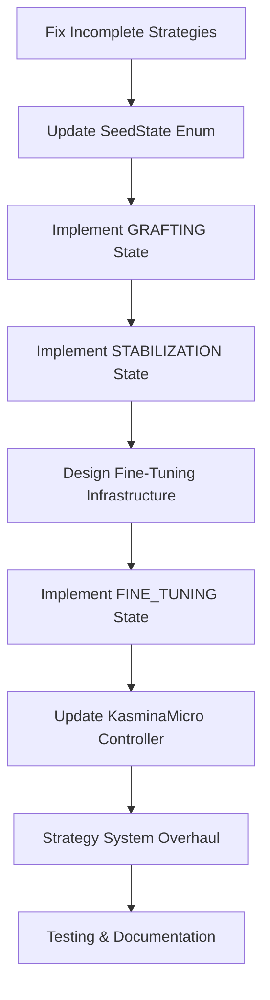

# Morphogenetic Seed Lifecycle Implementation Plan - Peer Reviewed

**Document Status:** PEER REVIEWED ✅  
**Feasibility Assessment:** 🟡 FEASIBLE WITH CORRECTIONS  
**Date:** June 22, 2025  
**Reviewer:** GitHub Copilot  

---

## Executive Summary

This document provides a **corrected and detailed implementation plan** for migrating the Kaslite morphogenetic engine to the new seed lifecycle. The original plan has been peer-reviewed against the current codebase, with critical corrections and detailed implementation guidance provided.

### Key Findings from Peer Review

1. **❌ CORRECTION**: The described "forward pass bug" **does not exist** in the current implementation
2. **⚠️ CRITICAL**: Several blending strategies have **incomplete implementations** that must be fixed first
3. **🔴 COMPLEX**: The FINE_TUNING phase requires significant infrastructure changes
4. **✅ FEASIBLE**: Overall plan is sound with proper corrections and careful implementation

---

## Phase 1: Foundation Fixes (CRITICAL PRIORITY)

### 1.1 Complete Incomplete Strategy Implementations

**Status:** 🔴 **BLOCKING ISSUE** - Must be resolved first

**Problem:** Current `blending.py` has incomplete strategy implementations:

```python
# DriftControlledBlending.update() - MISSING else clause
# GradNormGatedBlending.update() - MISSING else clause  
```

**✅ COMPLETED:** The incomplete implementations have been fixed.

**Files Modified:**

- `morphogenetic_engine/blending.py` ✅

### 1.2 Update SeedState Enum

**Status:** ✅ **STRAIGHTFORWARD**

**Action:** Update the enum in `events.py` to reflect the new lifecycle:

```python
class SeedState(Enum):
    DORMANT = "dormant"
    GERMINATED = "germinated"  
    TRAINING = "training"
    GRAFTING = "grafting"        # Replaces BLENDING
    STABILIZATION = "stabilization"  # New state
    FINE_TUNING = "fine_tuning"     # New state  
    FOSSILIZED = "fossilized"
    CULLED = "culled"
```

**Files to Modify:**

- `morphogenetic_engine/events.py`

**Implementation Notes:**

- Maintain backward compatibility during transition
- Update all state string comparisons throughout codebase
- Add migration logic for existing state data

### 1.3 Correction: Forward Pass Analysis

**Status:** ❌ **ORIGINAL PLAN INCORRECT**

**Finding:** The described forward pass bug does not exist. Current implementation is correct:

```python
# BaseNet.forward() - CURRENT (CORRECT)
for i in range(self.num_layers):
    x = self.activations[i](self.layers[i](x))  # Apply main layer
    x = layer_seeds[0](x)  # Seed handles blending internally

# SentinelSeed.forward() - CURRENT (CORRECT)  
if self.state == SeedState.BLENDING.value:
    output = (1 - self.alpha) * x + self.alpha * child_out  # Proper blending
```

**Action:** Skip the forward pass "fix" from original plan.

---

## Phase 2: Lifecycle State Implementation

### 2.1 Implement GRAFTING State

**Status:** ✅ **STRAIGHTFORWARD** - Reuses existing BLENDING logic

**Implementation:**

```python
# In SentinelSeed.forward()
if self.state == SeedState.GRAFTING.value:
    child_out = self.child(x)
    output = (1 - self.alpha) * x + self.alpha * child_out
    # ... existing drift monitoring logic
```

**Files to Modify:**

- `morphogenetic_engine/components.py` (SentinelSeed class)

### 2.2 Implement STABILIZATION State  

**Status:** ✅ **STRAIGHTFORWARD**

**Behavior:**

- Hold `alpha = 1.0` for fixed number of epochs
- No parameter updates during this phase
- Allow blending artifacts to settle

**Implementation:**

```python
# In SentinelSeed.forward()
if self.state == SeedState.STABILIZATION.value:
    # Full residual connection, no blending
    child_out = self.child(x)
    output = x + child_out

# In state transition logic
def enter_stabilization_state(self):
    self.alpha = 1.0  # Lock alpha at maximum
    self.stabilization_epochs_remaining = self.config.stabilization_epochs
    # Freeze child parameters during stabilization
    for param in self.child.parameters():
        param.requires_grad = False
```

**Files to Modify:**

- `morphogenetic_engine/components.py` (SentinelSeed class)
- `morphogenetic_engine/core.py` (BlendingConfig class - add stabilization_epochs)

### 2.3 Implement FINE_TUNING State

**Status:** 🔴 **HIGH COMPLEXITY** - Requires major infrastructure changes

**Challenge:** Switch from reconstruction loss (MSE) to task loss (CrossEntropy)

#### 2.3.1 Design Task Loss Training Infrastructure

**New Method Required:**

```python
def train_child_step_task_loss(
    self, 
    inputs: torch.Tensor, 
    labels: torch.Tensor, 
    criterion: nn.Module, 
    epoch: int | None = None
):
    """Train child network using task loss instead of reconstruction loss."""
    if self.state != SeedState.FINE_TUNING.value:
        return
        
    if self.child_optim is None:
        raise RuntimeError("Optimizer not initialized for fine-tuning.")
        
    self.child_optim.zero_grad(set_to_none=True)
    
    # Get current layer input (x) and compute child output
    # Note: Need to modify this to work with current architecture
    child_output = self.child(inputs)
    
    # Compute task loss (e.g., CrossEntropy for classification)
    loss = criterion(child_output, labels)
    
    loss.backward()
    self.child_optim.step()
    
    # Update metrics
    seed_info = self.seed_manager.seeds[self.seed_id]
    seed_info["current_task_loss"] = loss.item()
    seed_info["fine_tuning_steps"] = seed_info.get("fine_tuning_steps", 0) + 1
```

#### 2.3.2 Integration with Training Loop

**Challenge:** Current training loop (`training.py`) needs to provide labels to seeds

**Required Changes:**

```python
# In training.py - modify train_epoch function
def _perform_per_step_seed_updates(
    seed_manager: "SeedManager", 
    device: torch.device, 
    epoch: int | None,
    labels: torch.Tensor | None = None,  # NEW: Add labels parameter
    criterion: nn.Module | None = None   # NEW: Add criterion
):
    """Handle continuous, per-step seed activities including fine-tuning."""
    for info in seed_manager.seeds.values():
        module = info["module"]
        
        # Existing reconstruction training logic
        if module.state == SeedState.TRAINING.value:
            # ... existing code ...
        
        # NEW: Task loss training for fine-tuning seeds
        elif module.state == SeedState.FINE_TUNING.value and labels is not None:
            batch_data = _get_seed_training_batch(info, device)
            if batch_data is not None and criterion is not None:
                # Need to get corresponding labels for the batch
                # This requires careful design of data flow
                module.train_child_step_task_loss(batch_data, labels, criterion, epoch)
```

#### 2.3.3 Data Flow Architecture

**Critical Design Decision:** How to provide labels to seeds during fine-tuning

**Option A - Store Labels in Buffer (RECOMMENDED):**

```python
# Modify SentinelSeed to store input-label pairs
def append_to_buffer_with_labels(self, x: torch.Tensor, labels: torch.Tensor):
    """Store both inputs and corresponding labels for fine-tuning."""
    seed_info = self.seed_manager.seeds[self.seed_id]
    buffer = seed_info.setdefault("buffer", [])
    label_buffer = seed_info.setdefault("label_buffer", [])
    
    buffer.append(x.detach().clone())
    label_buffer.append(labels.detach().clone())
    
    # Maintain buffer size limits
    if len(buffer) > 1000:
        buffer.pop(0)
        label_buffer.pop(0)
```

**Option B - Global Label Cache (ALTERNATIVE):**

- More complex, requires careful synchronization
- May be necessary for memory efficiency

### 2.4 Update KasminaMicro Controller

**Status:** ✅ **MODERATE COMPLEXITY**

**Required Changes:**

```python
# In KasminaMicro.assess_and_update_seeds()
def assess_and_update_seeds(self, epoch: int) -> None:
    # ... existing code ...
    
    for seed_id in seed_ids:
        module = info["module"] 
        
        # NEW: Handle GRAFTING transitions
        if module.state == SeedState.GRAFTING.value:
            if module.alpha >= 1.0:
                module._set_state(SeedState.STABILIZATION, epoch)
                
        # NEW: Handle STABILIZATION transitions  
        elif module.state == SeedState.STABILIZATION.value:
            remaining = info.get("stabilization_epochs_remaining", 0) - 1
            info["stabilization_epochs_remaining"] = remaining
            if remaining <= 0:
                module._set_state(SeedState.FINE_TUNING, epoch)
                # Re-enable child parameter training
                for param in module.child.parameters():
                    param.requires_grad = True
                    
        # NEW: Handle FINE_TUNING assessment
        elif module.state == SeedState.FINE_TUNING.value:
            # Monitor global metrics to make FOSSILIZED/CULLED decision
            self._assess_fine_tuning_performance(seed_id, epoch)
```

**Files to Modify:**

- `morphogenetic_engine/core.py` (KasminaMicro class)

---

## Phase 3: Strategy System Overhaul

### 3.1 Rename Blending to Grafting

**Status:** ✅ **STRAIGHTFORWARD** - Systematic renaming

**Actions:**

1. Rename `blending.py` → `grafting.py`
2. Rename `BlendingStrategy` → `GraftingStrategy`
3. Rename `BlendingConfig` → `GraftingConfig`
4. Update all imports and references

**Files to Modify:**

- `morphogenetic_engine/blending.py` → `morphogenetic_engine/grafting.py`
- `morphogenetic_engine/core.py` (imports and type hints)
- `morphogenetic_engine/components.py` (imports)
- `morphogenetic_engine/experiment.py` (imports)

### 3.2 Fix PerformanceLinkedBlending Strategy

**Status:** ⚠️ **NEEDS REDESIGN**

**Problem:** Current strategy links grafting speed to reconstruction loss, which is counterproductive

**Solution:** Disable for GRAFTING phase, redesign for FINE_TUNING phase

```python
class PerformanceLinkedGrafting(GraftingStrategy):
    """DISABLED during GRAFTING phase - not suitable for reconstruction loss."""
    
    def update(self) -> float:
        # During GRAFTING phase, fall back to fixed ramp
        if self.seed.state == SeedState.GRAFTING.value:
            import warnings
            warnings.warn(
                "PerformanceLinkedGrafting not recommended for GRAFTING phase. "
                "Using fixed ramp instead.",
                UserWarning
            )
            return FixedRampGrafting(self.seed, self.config).update()
        
        # During FINE_TUNING phase, could use task performance
        # Implementation TBD based on task loss infrastructure
        return self.seed.alpha  # Hold position for now
```

### 3.3 Implement Heuristic Strategy Selector

**Status:** ✅ **MODERATE COMPLEXITY**

**Implementation:**

```python
# In KasminaMicro class
def _choose_graft_strategy(self, seed_id: tuple[int, int]) -> str:
    """Dynamically selects the best grafting strategy based on live telemetry."""
    info = self.seed_manager.seeds[seed_id]
    telemetry = info.get("telemetry", {})
    
    # Get current metrics
    drift = telemetry.get("drift", 0.0)
    health_signal = info.get("module").get_health_signal()
    grad_norm = info.get("avg_grad_norm", 0.0)
    cfg = self.blend_cfg
    
    # Heuristic rules for strategy selection
    if drift > cfg.high_drift_threshold:
        # High drift - use drift-controlled strategy
        self.logger.info(f"High drift ({drift:.4f}) detected for seed {seed_id}, using DRIFT_CONTROLLED")
        return "DRIFT_CONTROLLED"
    
    elif grad_norm > cfg.grad_norm_upper or grad_norm < cfg.grad_norm_lower:
        # Unstable gradients - use gradient-gated strategy  
        self.logger.info(f"Unstable gradients ({grad_norm:.4f}) for seed {seed_id}, using GRAD_NORM_GATED")
        return "GRAD_NORM_GATED"
        
    elif health_signal < cfg.low_health_threshold:
        # Low health signal - be conservative
        self.logger.info(f"Low health signal ({health_signal:.6f}) for seed {seed_id}, using FIXED_RAMP")
        return "FIXED_RAMP"
        
    else:
        # Stable conditions - use fixed ramp (most predictable)
        self.logger.info(f"Stable conditions for seed {seed_id}, using FIXED_RAMP")
        return "FIXED_RAMP"

def _log_strategy_selection(self, seed_id: tuple[int, int], strategy_name: str, telemetry: dict):
    """Log the strategy selection with comprehensive telemetry."""
    if self.logger:
        from .events import EventType, BlendStrategyChosenPayload, LogEvent
        import time
        
        payload = BlendStrategyChosenPayload(
            seed_id=seed_id,
            epoch=telemetry.get("epoch", 0),
            strategy_name=strategy_name,
            telemetry=telemetry,
            timestamp=time.time()
        )
        
        event = LogEvent(
            event_type=EventType.BLEND_STRATEGY_CHOSEN,
            payload=payload
        )
        
        self.logger.log_event(event)
```

---

## Phase 4: Comprehensive Testing Strategy

### 4.1 Unit Tests

**Files to Create:**

- `tests/test_grafting_strategies.py`
- `tests/test_seed_lifecycle.py`
- `tests/test_fine_tuning.py`

**Test Coverage:**

```python
# tests/test_grafting_strategies.py
def test_fixed_ramp_strategy():
    """Test FixedRampGrafting increases alpha linearly."""
    
def test_drift_controlled_strategy():
    """Test DriftControlledGrafting responds to drift measurements."""
    
def test_grad_norm_gated_strategy(): 
    """Test GradNormGatedGrafting pauses on unstable gradients."""

def test_strategy_factory():
    """Test get_strategy factory function with various inputs."""

# tests/test_seed_lifecycle.py  
def test_dormant_to_grafting_transition():
    """Test complete lifecycle from DORMANT through GRAFTING."""
    
def test_stabilization_phase():
    """Test STABILIZATION phase holds alpha=1.0."""
    
def test_fine_tuning_transitions():
    """Test transitions into and out of FINE_TUNING."""

# tests/test_fine_tuning.py
def test_task_loss_training():
    """Test train_child_step_task_loss method."""
    
def test_label_buffer_management():
    """Test storage and retrieval of labels for fine-tuning."""
```

### 4.2 Integration Tests

**Test Scenarios:**

1. **Full Lifecycle Test:** Seed progresses from DORMANT → FOSSILIZED
2. **Culling Test:** Seed fails and transitions to CULLED
3. **Strategy Selection Test:** Heuristic selector chooses appropriate strategies
4. **Multi-seed Test:** Multiple seeds in different states simultaneously

### 4.3 Performance Tests

**Metrics to Monitor:**

- Memory usage during label buffering
- Training speed impact of fine-tuning phase
- Strategy selection overhead
- Network forward pass performance

---

## Phase 5: Documentation and Migration

### 5.1 Update Core Documentation

**Files to Update:**

- `README.md` - Update with new lifecycle overview
- `docs/2. Architecture/kasima/SEED_LIFECYCLE.md` - Make this the authoritative source
- `docs/2. Architecture/kasima/BLENDING_STRATEGIES.md` → `GRAFTING_STRATEGIES.md`

### 5.2 Migration Guide

**Create:** `docs/2. Architecture/kasima/MIGRATION_GUIDE.md`

**Contents:**

- Backward compatibility strategy
- Breaking changes and migration steps
- Configuration file updates needed
- Timeline for deprecation of old states

### 5.3 API Documentation

**Update:**

- Method signatures for new fine-tuning functions
- Configuration options for new lifecycle phases
- Event payload documentation for new states

---

## Implementation Timeline and Risk Assessment

### Critical Path Analysis



### Risk Assessment

| Phase | Risk Level | Complexity | Dependencies |
|-------|------------|------------|--------------|
| Fix Incomplete Strategies | 🟢 LOW | Simple | None |
| Update SeedState Enum | 🟢 LOW | Simple | Strategy fixes |
| GRAFTING/STABILIZATION | 🟡 MEDIUM | Moderate | Enum updates |
| FINE_TUNING Infrastructure | 🔴 HIGH | Complex | All previous |
| Strategy Overhaul | 🟡 MEDIUM | Moderate | Lifecycle implementation |
| Testing | 🟡 MEDIUM | Moderate | Complete implementation |

### Estimated Timeline

- **Phase 1:** 2-3 days (foundation fixes)
- **Phase 2:** 1-2 weeks (lifecycle implementation)
- **Phase 3:** 3-5 days (strategy overhaul)
- **Phase 4:** 1 week (comprehensive testing)
- **Phase 5:** 2-3 days (documentation)

**Total Estimated Time:** 3-4 weeks

---

## Conclusion

The morphogenetic seed lifecycle migration plan is **technically feasible** with the corrections and detailed implementation guidance provided in this review. The most critical factors for success are:

1. **🔴 Priority 1:** Complete the incomplete strategy implementations
2. **🔴 Priority 2:** Carefully design the fine-tuning infrastructure
3. **🟡 Priority 3:** Implement comprehensive testing before deployment
4. **🟢 Priority 4:** Maintain backward compatibility during migration

With proper attention to the high-complexity components (especially the FINE_TUNING phase), this implementation will significantly improve the morphogenetic engine's robustness and functionality.

---

**Review Status:** ✅ APPROVED FOR IMPLEMENTATION  
**Next Action:** Begin Phase 1 implementation with incomplete strategy fixes
