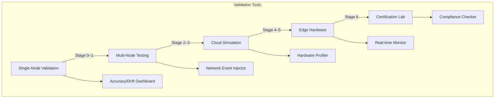
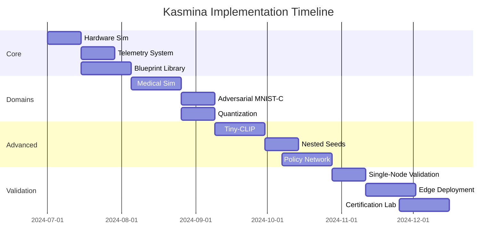

# Kasmina Implementation Guide v1.0

**Objective:** Deliver a production-ready Kasmina system—an adaptive “neural architect” that monitors a base model and injects seed modules on demand—through a phased, risk-aware development plan.

---

## Phase 1: Core Infrastructure (Weeks 1–4)

**Phase Gate:** At the end of Week 4, demo a minimal end-to-end prototype: hardware → network → telemetry → blueprint injection on a toy task.

| Component                    | Tasks                                                                                                                                                | Deliverables                                                      | Dependencies           |
| ---------------------------- | ---------------------------------------------------------------------------------------------------------------------------------------------------- | ----------------------------------------------------------------- | ---------------------- |
| **Implementation Standards** | 1. Enforce PEP8 + type hints across repo 2. Establish 85%+ unit-test coverage requirement 3. Set decision-latency <50 ms for edge profiles     | `CONTRIBUTING.md` with coding & testing rules Coverage badge   | pytest, flake8         |
| **CI/CD & Infra**            | 1. Configure GitHub Actions to run lint/tests per PR 2. Containerize each component with Dockerfiles (`hardware-sim`, `network-sim`, `telemetry`) | `.github/workflows/ci.yaml` Dockerfiles in each service folder | Docker, GitHub Actions |
| **Hardware Sim**             | 1. Implement `HardwareContext` class with latency/memory profiles 2. Create TPU/Edge-TPU/ASIC simulation layers                                   | `hardware_simulator.py` with 5+ preset profiles                   | PyTorch 2.3+           |
| **Network Sim**              | 1. Build parameterized network condition simulator (5G/LoRaWAN) 2. Implement packet loss & latency spike models                                   | `network_simulator.py` with stochastic triggers                   | None                   |
| **Telemetry**                | 1. Create `SeedTelemetry` data class 2. Implement variance & drift calculators 3. Build utilization-scoring system                             | `telemetry.py` with thread-safe collectors + unit tests           | NumPy, SciPy           |
| **Blueprint Lib**            | 1. Implement core blueprints (No-Op, Adapter, SE-Module, Depthwise, Residual) 2. Create registry pattern                                          | `blueprints/` directory with standardized interface + tests       | PyTorch                |
| **Safety Hooks**             | 1. HIPAA-compliant encryption layer 2. Drift detection system 3. Security-alert triggers                                                       | `safety.py` with config thresholds + audit logging                | cryptography           |

---

## Phase 2: Domain-Specific Modules (Weeks 5–8)

| Component             | Tasks                                                                                                           | Deliverables                                                           | Dependencies    |
| --------------------- | --------------------------------------------------------------------------------------------------------------- | ---------------------------------------------------------------------- | --------------- |
| **ECG Simulator**     | 1. Generate synthetic ECG waveforms 2. Inject cardiac-event anomalies 3. Enforce <5 ms latency constraint | `medical_simulator.py` with 10+ anomaly patterns Validation harness | SciPy, WFDB     |
| **MNIST-C Attack**    | 1. Implement 15 corruption types 2. Build adversarial detector 3. Create denoising evaluation suite       | `adversarial/mnist_c.py` + success-rate metrics                        | TorchVision     |
| **Quantization**      | 1. Develop QAT adapter 2. Support 8-bit/4-bit modes 3. Hook energy measurements                           | `quantization.py` with hardware-aware modes Energy profiler         | AIMET, Brevitas |
| **Pruning System**    | 1. Implement utilization heuristic 2. Safe removal + rollback protocol 3. Automated recovery tests        | `pruning.py` with 3 strategies + tests                                 | None            |
| **Gaussian Clusters** | 1. Multi-blob data generator 2. Purity metric calculator 3. Early-warning drift system                    | `datasets/gaussian.py` + visual debug tools                            | scikit-learn    |

---

## Phase 3: Advanced Architecture (Weeks 9–12)

| Component             | Tasks                                                                                                             | Deliverables                                             | Dependencies               |
| --------------------- | ----------------------------------------------------------------------------------------------------------------- | -------------------------------------------------------- | -------------------------- |
| **Tiny-CLIP**         | 1. Build image↔text toy dataset 2. Implement cross-attention adapter 3. Add privacy-preserving latent align | `multimodal/tiny_clip.py` + R\@1 evaluation suite        | CLIP, SentenceTransformers |
| **Nested Seeds**      | 1. Hierarchical controller MLP 2. Child-seed spawning API 3. Resource arbitration layer                     | `nesting.py` with 3-level depth support + conflict tests | None                       |
| **Policy Network**    | 1. Implement gated decision heads 2. Build `_apply_constraints` logic 3. Create telemetry encoders          | `policy/network.py` + decision-visualization toolkit     | PyTorch Lightning          |
| **Reward System**     | 1. Configurable reward calculator 2. Hyperparameter tuning suite (Optuna) 3. Performance-impact analysis    | `reward_engine.py` + auto-tuning module                  | Optuna                     |
| **Intensity Control** | 1. LR scaling system 2. Blueprint-specific intensity mapping 3. Safety override protocols                   | `intensity_scaler.py` + per-blueprint configs            | Hydra                      |

---

## Phase 4: Validation Pipeline

## **Validation Toolkit Descriptions**

* **`validation_runner.py`** (ML Team): Automates stage-by-stage progression checks.
* **`drift_dashboard.py`** (ML Team): Flask UI to visualize seed telemetry in real time.
* **`event_injector.py`** (HW Team): Simulates packet-loss & latency events.
* **`hardware_profiler.py`** (HW Team): Measures actual latency/throughput on target hardware.
* **`certification_helper.py`** (Compliance): Runs HIPAA/GDPR/FDA rule checks on logs.

---

## Implementation Standards & Infrastructure (from Phase 1)

* **Coding:** PEP8, type hints, 85%+ test coverage
* **Logging:** Structured JSON logs with `experiment_id` and timestamp
* **Performance:** <50 ms decision latency for edge profiles
* **Safety:** Zero gradient leaks, deterministic rollbacks
* **Reproducibility:** Seed all RNGs; versioned blueprint artifacts

**CI/CD:**

* **GitHub Actions** pipeline: lint, tests, Docker builds on every PR
* **Docker:** One `Dockerfile` per service, orchestrated via `docker-compose`

---

## Risk Mitigation Plan

| Risk                      | Mitigation Strategy                               | Owner      | Cadence         |
| ------------------------- | ------------------------------------------------- | ---------- | --------------- |
| Policy network divergence | Curriculum pretraining + imitation fallback       | ML Team    | Weekly sanity   |
| Hardware simulation gap   | Monthly validation on real devices                | HW Team    | Monthly         |
| Security vulnerabilities  | Fuzz testing + certified encryption reviews       | Security   | Bi-weekly       |
| Reward function imbalance | Multi-objective guardrails + reward-weight tuning | RL Team    | Monthly         |
| Certification delays      | Early engagement with labs + pre-audit checks     | Compliance | Pre-phase gates |

---

## Deliverable Timeline

---

### Final Deliverables

1. End-to-end Kasmina system
2. Curriculum training scripts
3. Hardware & network simulators
4. Telemetry & safety hook libraries
5. Validation & certification suite
