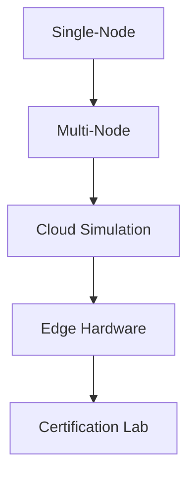

# Tamiyo Curriculum & System Specification v1.0

## 1. Introduction

We’re building **Kasmina**, an adaptive “neural architect” that watches your base model’s metrics and bursts in new sub-modules (seeds) whenever extra capacity or specialised processing is needed. This document lays out:

* A **progressive curriculum** (Stage 0 → Stage 6) to train Kasmina across tasks of increasing complexity.
* A **blueprint library** of ready-made seed modules.
* The **telemetry** Kasmina consumes at each decision point.
* The **policy network** architecture and its gating logic.
* Clear definitions for **intensity**, **reward**, and **stage guardrails**.
* An **implementation roadmap** and **validation pipeline**.

With everything specified, there should be zero ambiguity when translating this into code.

---

## 2. Curriculum Stages

Each stage introduces a new task, hardware profile and safety constraints. Kasmina’s job is to decide **which** blueprint to inject, **where**, and with **what intensity**. We only move to the next stage once accuracy, safety and latency targets are met.

|  Stage  | Task                                   | Success                      | Safety                                         | Hardware          | Blueprints                                   |
| :-----: | -------------------------------------- | ---------------------------- | ---------------------------------------------- | ----------------- | -------------------------------------------- |
|  **0**  | 2D Spirals                             | ≥ 99 % accuracy              | Drift (cos < 0.15)                             | CPU               | Bottleneck Adapter, Low-Rank Residual, No-Op |
|  **1**  | Tiny Vision (MNIST-like)               | ≥ 92 % accuracy              | Rollback > 98 %, Adversarial Δ < 5 %           | GPU               | SE-Module, Depthwise Conv, No-Op             |
|  **2**  | Char-Level Language (tiny Transformer) | ≤ 1.0 BPC                    | Security alert = false                         | GPU               | Adapter, Mini Self-Attention, No-Op          |
| **2.5** | Adversarial Vision (MNIST-C)           | ≥ 90 % corr. accuracy        | Denoise > 95 %, Rollback > 98 %                | GPU               | Denoiser AE, Attention Filter, No-Op         |
|  **3**  | ECG Time-Series (Medical Simulator)    | AUC ≥ 0.95                   | Latency < 5 ms, HIPAA sim, Encryption enforced | Edge-TPU          | Sliding Conv, Sparse Activation, No-Op       |
| **3.5** | Gaussian Clusters (2–5 blobs)          | ≥ 95 % purity                | Drift < 0.05, Security alert = false           | Edge-TPU          | SE-Module, GLU, No-Op                        |
|  **4**  | Concentric Spheres (10-D)              | ≥ 97 % accuracy              | Drift (cos < 0.10), Rollback > 99 %            | TPU               | Mini Attention, Depthwise Conv, No-Op        |
| **4.5** | Tiny-CLIP (Image↔Text toy)             | R\@1 ≥ 60 %                  | Cross-modal drift < 0.05, Privacy passed       | TPU               | Cross-Attention Adapter, Latent Align, No-Op |
|  **5**  | XOR-N / Checkerboard (higher-D)        | ≥ 99 % accuracy              | Drift < 0.05, Utilization check                | GPU               | Nested Seed, Low-Rank Residual, No-Op        |
|  **6**  | Edge Deployment (IMU + Network sim)    | ≥ 88 % accuracy; ≤ 15 μJ/inf | Packet loss < 15 %, Latency budget             | LoRa/5G/ASIC sims | Quant-Adapter, Pruning, Fail-Safe Gating     |

**Advance Guardrails**

```python
def can_advance(metrics, safety, hardware):
    return (
        metrics['accuracy'] >= TARGET_ACC and
        safety['rollback_rate'] >= 0.98 and
        safety['drift'] <= DRIFT_THRESH and
        hardware['latency_ms'] <= hardware['max_latency']
    )
```

---

## 3. Blueprint Library

We keep a static set of candidate modules—each suited to particular bottleneck patterns:

| Name                   | Structure                                            |        Parameters | Use Case                  |
| ---------------------- | ---------------------------------------------------- | ----------------: | ------------------------- |
| **No-Op**              | identity(x)                                          |                 0 | do nothing                |
| **Bottleneck Adapter** | Linear(d→k)→ReLU→Linear(k→d)                         |             2·d·k | tiny capacity boost       |
| **Low-Rank Residual**  | Linear(d→r)→ReLU→Linear(r→d)+x                       |             2·d·r | efficient non-linear lift |
| **Residual MLP**       | Linear(d→h)→ReLU→Linear(h→d)+x                       |             2·d·h | general capacity          |
| **SE-Module**          | GP→Linear(d→d/r)→ReLU→Linear(d/r→d)→Sigmoid→scale(x) |            2·d²/r | channel recalibration     |
| **Depthwise Conv**     | Depthwise(k×k)→Pointwise(1×1)                        |         k²·d + d² | local spatial processing  |
| **Mini Attention**     | QKV proj×3, scaled dot, output proj                  |   \~3·d²/heads+d² | context dependencies      |
| **GLU Block**          | Linear(d→2d)→\[x,a]→x·σ(a)                           |              2·d² | gated flow                |
| **Denoising AE**       | Conv/MLP encoder–decoder                             |     task-specific | adversarial filtration    |
| **Sliding Conv**       | 1D Conv(kernel)→…                                    |          kernel·d | time-series features      |
| **Sparse Activation**  | top-k sparsify + Linear                              |         \~d log d | novelty / efficiency      |
| **Cross-Attention**    | cross-modal QKV + residual                           | ≈Attention params | image/text alignment      |
| **Latent Align**       | MLP residual on joint embedding                      |              ≈5 K | modality fusion           |
| **Nested Seed**        | small controller MLP → spawns child seed             |              ≈300 | hierarchical growth       |
| **Quant-Adapter**      | Linear(d→k)→QAT→Linear(k→d)                          |             2·d·k | edge quantisation         |
| **Pruning Adapter**    | remove lowest-util seed by heuristic                 |                 0 | model slimming            |
| **Fail-Safe Gating**   | σ(gate)·x + (1–σ)·new                                |   d + new\_params | emergency fallback        |

---

## 4. Seed-Health Telemetry

At each decision tick, every registered seed emits:

1. **Activation Variance** (last N batches)
2. **Interface Drift** = 1 – cosine\_similarity(input, output)
3. **Gradient Norm** (seed params)
4. **Utilization Score** = α·L1(weights) + β·mean(|output|) + γ·loss\_impact
5. **Age** (steps since germination)
6. **Resource Budget** (remaining ATP)
7. **Hardware Context** (latency, memory usage)
8. **Safety Scores** (drift\_risk, rollback\_need, security\_alert)

These form the **telemetry vector** fed into Kasmina’s policy net.

---

## 5. Policy Network Design

This neural controller turns telemetry into a choice of blueprint, location and intensity—while respecting safety and hardware constraints.

```python
class EnhancedKasminaPolicy(nn.Module):
    def __init__(self, input_dim, num_blueprints, seed_count):
        super().__init__()
        self.encoder = nn.Sequential(
            nn.Linear(input_dim, 128), nn.ReLU()
        )
        self.decision_heads = nn.ModuleDict({
            'choice':    nn.Linear(128, num_blueprints + 1),  # +1 for No-Op
            'location':  nn.Linear(128, seed_count),
            'intensity': nn.Linear(128, 1),
        })
        self.safety_head = nn.Linear(128, 3)  # drift_risk, rollback_need, security_alert
        self.hw_head     = nn.Linear(128, 2)  # latency_ok, memory_ok

    def forward(self, telemetry):
        h = self.encoder(telemetry)
        choice_logits = self.decision_heads['choice'](h)
        loc_logits    = self.decision_heads['location'](h)
        intensity_raw = torch.sigmoid(self.decision_heads['intensity'](h))
        safety_scores = torch.sigmoid(self.safety_head(h))
        hw_scores     = torch.sigmoid(self.hw_head(h))

        # apply gates/masks
        choice_masked, loc_masked = self._apply_constraints(
            choice_logits, loc_logits, safety_scores, hw_scores
        )

        return {
            'choice':    F.softmax(choice_masked, dim=-1),
            'location':  F.softmax(loc_masked, dim=-1),
            'intensity': intensity_raw
        }

    def _apply_constraints(self, choice, loc, safety, hw):
        # 1) security_alert → force No-Op
        if safety[2] > 0.5:
            choice[:] = float('-inf')
            choice[..., 0] = 0.0  # index 0 = No-Op
        # 2) drift_risk → ban heavy modules
        if safety[0] > 0.7:
            for idx in high_capacity_ids:
                choice[..., idx] = float('-inf')
        # 3) hardware violations
        for idx in range(choice.size(-1)):
            if not hw[0] or not hw[1]:
                choice[..., idx] = float('-inf')
        return choice, loc
```

---

## 6. Intensity Semantics

* **Definition:** scalar ∈ \[0, 1]
* **Role:** scales the new seed’s learning rate when training kicks off:

  ```python
  for p in new_seed.parameters():
      p_group['lr'] = base_lr * intensity
  ```

---

## 7. Reward Function & Tuning

All weights are hyperparameters—tune them in early pilots.

```python
REWARDS = {
  'acc_gain':      10.0,
  'param_penalty': 0.01,
  'latency_penalty': 0.1,
  'drift_bonus':   5.0,
  'security_penalty': 20.0,
}

def calculate_reward(metrics, safety, hardware):
    base  = REWARDS['acc_gain'] * (metrics['post_acc'] - metrics['pre_acc'])
    p_pen = -REWARDS['param_penalty'] * (metrics['new_params']/1e6)
    l_pen = -REWARDS['latency_penalty'] * max(0, hardware['latency_delta'])
    s_bo  = REWARDS['drift_bonus'] if safety['drift'] < 0.05 else 0
    sec_pen = -REWARDS['security_penalty'] if safety['security_alert'] else 0
    hw_eff = (hardware['memory_ok'] + hardware['latency_ok']) / 2
    return base + p_pen + l_pen + s_bo + sec_pen + 2.0 * hw_eff
```

---

## 8. Implementation Roadmap

1. **Weeks 1–4**

   * Build hardware & network simulators
   * Implement telemetry & safety hooks
   * Code up blueprint modules

2. **Weeks 5–8**

   * ECG data generator + HIPAA sim
   * Adversarial MNIST-C framework
   * Quant-Adapter & Pruning logic

3. **Weeks 9–12**

   * Tiny-CLIP cross-modal pipeline
   * Nested seed orchestration
   * Reward hyperparameter tuning & imitation bootstrap

4. **Validation Pipeline**
   Single-node → multi-node → cloud sim → edge hardware → certification lab

---

### 9. Validation Pipeline Diagram



---
